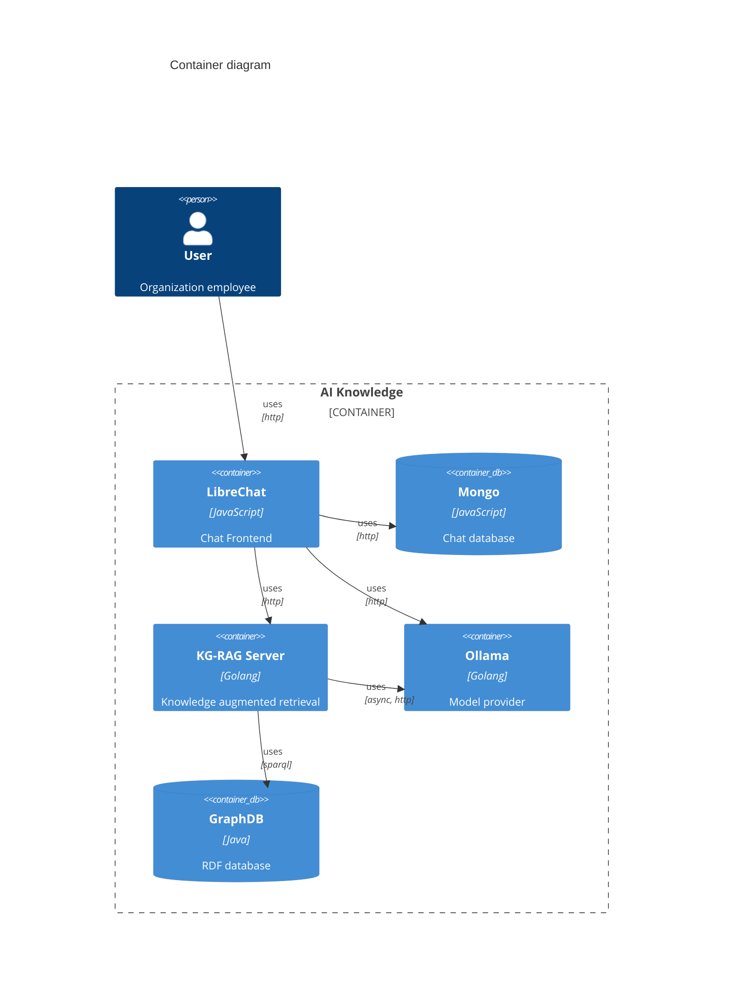
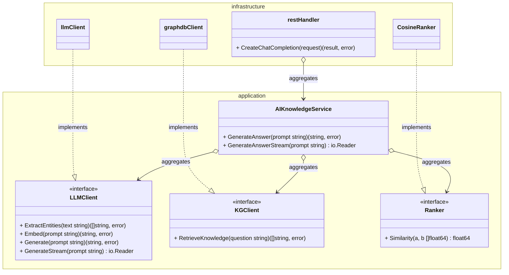

# Architecture

## C4 Diagram

```mermaid
C4Container
    title Container diagram

    Person(user, "User", "Organization employee")

    Container_Boundary(app, "AI Knowledge") {
        Container(librechat, "LibreChat", "JavaScript", "Chat Frontend")
        ContainerDb(mongo, "Mongo", "JavaScript", "Chat database")

        Container(kg-rag-server, "KG-RAG Server", "Golang", "Knowledge augmented retrieval")
        Container(ollama, "Ollama", "Golang", "Model provider")
        ContainerDb(graphdb, "GraphDB", "Java", "RDF database")
    }

    Rel(user, librechat, "uses", "http")
    UpdateRelStyle(user, librechat, $offsetY="30", $offsetX="40")

    Rel(librechat, mongo, "uses", "http")
    Rel(librechat, ollama, "uses", "http")
    Rel(librechat, kg-rag-server, "uses", "http")

    Rel(kg-rag-server, ollama, "uses", "async, http")
    Rel(kg-rag-server, graphdb, "uses", "sparql")
```

## UML Diagram

```mermaid
classDiagram
    namespace application {
        class AIKnowledgeService {
            + GenerateAnswer(prompt string) (string, error)
            + GenerateAnswerStream(prompt string) io.Reader
        }

        class LLMClient {
            <<interface>>
            + ExtractEntities(text string) ([]string, error)
            + Embed(prompt string) (string, error)
            + Generate(prompt string) (string, error)
            + GenerateStream(prompt string) io.Reader
        }

        class KGClient {
            <<interface>>
            + RetrieveKnowledge(question string) ([]string, error)
        }
        
        class Ranker {
            <<interface>>
            + Similarity(a, b []float64) float64
        }
    }
    
    namespace infrastructure {
        class llmClient {
        }
        class graphdbClient {
        }
        class CosineRanker {
        }
        class restHandler {
            + CreateChatCompletion(request) (result, error)
        }
    }

    CosineRanker ..|> Ranker : implements
    graphdbClient ..|> KGClient : implements
    llmClient ..|> LLMClient : implements
    
    AIKnowledgeService o--> KGClient : aggregates
    AIKnowledgeService o--> LLMClient : aggregates
    AIKnowledgeService o--> Ranker : aggregates
    
    restHandler o--> AIKnowledgeService : aggregates
```
