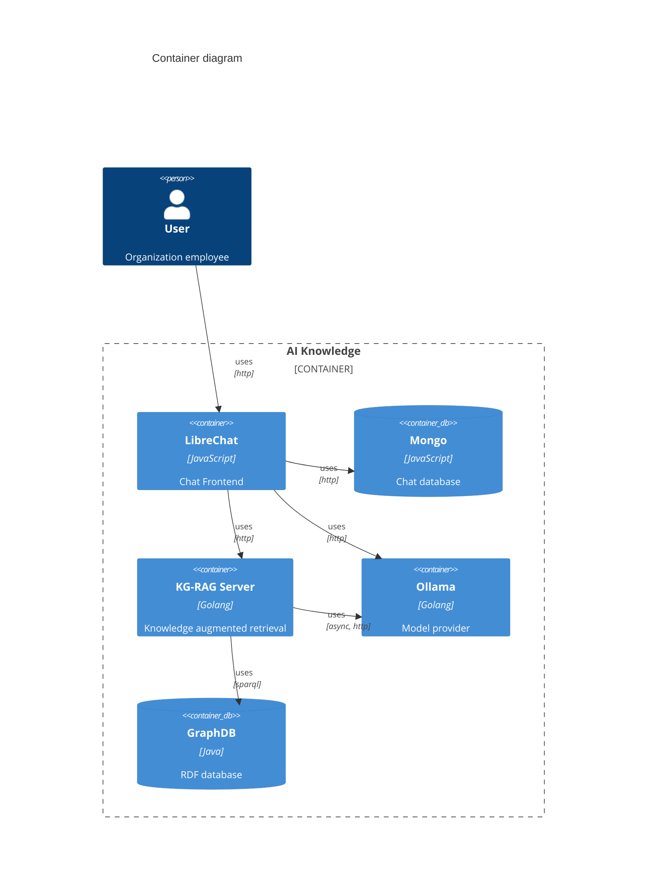

# C4 Diagram

```mermaid
C4Container
    title Container diagram

    Person(user, "User", "Organization employee")

    Container_Boundary(app, "AI Knowledge") {
        Container(librechat, "LibreChat", "JavaScript", "Chat Frontend")
        ContainerDb(mongo, "Mongo", "JavaScript", "Chat database")

        Container(kg-rag-server, "KG-RAG Server", "Golang", "Knowledge augmented retrieval")
        Container(ollama, "Ollama", "Golang", "Model provider")
        ContainerDb(graphdb, "GraphDB", "Java", "RDF database")
    }

    Rel(user, librechat, "uses", "http")
    UpdateRelStyle(user, librechat, $offsetY="30", $offsetX="40")

    Rel(librechat, mongo, "uses", "http")
    Rel(librechat, ollama, "uses", "http")
    Rel(librechat, kg-rag-server, "uses", "http")

    Rel(kg-rag-server, ollama, "uses", "async, http")
    Rel(kg-rag-server, graphdb, "uses", "sparql")
```
