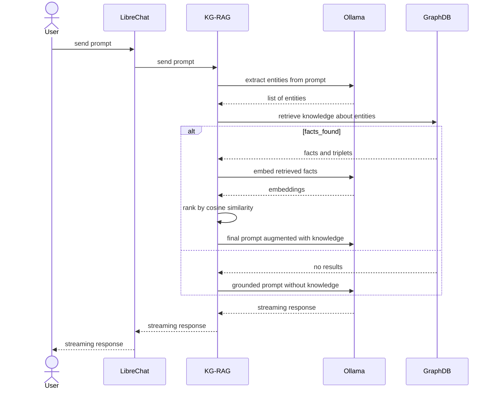

## Sequence Diagram

```mermaid
sequenceDiagram
    actor User
    participant LibreChat
    participant KG-RAG
    participant Ollama
    participant GraphDB
    
    User ->> LibreChat : send prompt
    LibreChat ->> KG-RAG : send prompt
    
    KG-RAG ->> Ollama : extract entities from prompt
    Ollama -->> KG-RAG : list of entities
    KG-RAG ->> GraphDB : retrieve knowledge about entities
    alt facts_found
        GraphDB -->> KG-RAG : facts and triplets
        KG-RAG ->> Ollama : embed retrieved facts
        Ollama -->> KG-RAG : embeddings
        KG-RAG ->> KG-RAG : rank by cosine similarity
        KG-RAG ->> Ollama : final prompt augmented with knowledge
    else
        GraphDB -->> KG-RAG : no results
        KG-RAG ->> Ollama : grounded prompt without knowledge
    end
    Ollama -->> KG-RAG : streaming response
    KG-RAG -->> LibreChat : streaming response
    
    LibreChat -->> User : streaming response
```
