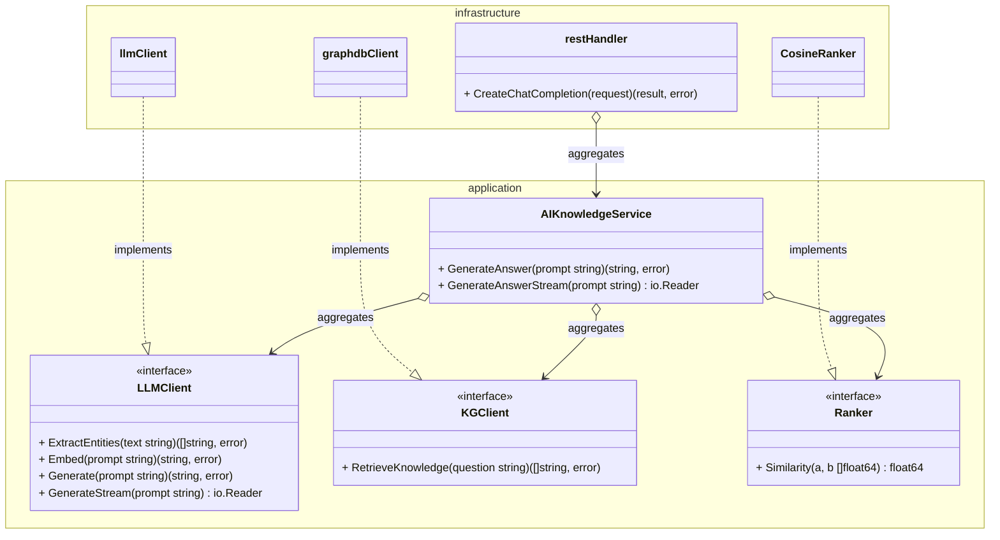

## UML Diagram

```mermaid
classDiagram
    namespace application {
        class AIKnowledgeService {
            + GenerateAnswer(prompt string) (string, error)
            + GenerateAnswerStream(prompt string) io.Reader
        }

        class LLMClient {
            <<interface>>
            + ExtractEntities(text string) ([]string, error)
            + Embed(prompt string) (string, error)
            + Generate(prompt string) (string, error)
            + GenerateStream(prompt string) io.Reader
        }

        class KGClient {
            <<interface>>
            + RetrieveKnowledge(question string) ([]string, error)
        }
        
        class Ranker {
            <<interface>>
            + Similarity(a, b []float64) float64
        }
    }
    
    namespace infrastructure {
        class llmClient {
        }
        class graphdbClient {
        }
        class CosineRanker {
        }
        class restHandler {
            + CreateChatCompletion(request) (result, error)
        }
    }

    CosineRanker ..|> Ranker : implements
    graphdbClient ..|> KGClient : implements
    llmClient ..|> LLMClient : implements
    
    AIKnowledgeService o--> KGClient : aggregates
    AIKnowledgeService o--> LLMClient : aggregates
    AIKnowledgeService o--> Ranker : aggregates
    
    restHandler o--> AIKnowledgeService : aggregates
```
